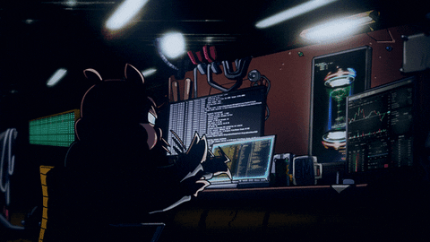

<!-- ========================================================= -->
<!--                           HERO                            -->
<!-- ========================================================= -->

  

<h1 align="center">
  PRAJWAL BELEKAR
</h1>

  

  software · artificial intelligence · data · security

 

<!-- ========================================================= -->
<!--                         ABOUT ME                          -->
<!-- ========================================================= -->

<h2 align="center">About Me</h2>

 

  

  I'm an engineering student who enjoys building things and figuring out
   
  how they work.

  Most of my interests revolve around
  <b>software development, AI/ML, data science, and cybersecurity.</b>

  I like learning by actually doing things — trying new ideas,
   
  solving problems, and occasionally breaking something along the way.

  <i>Always curious. Always learning. Usually working on something.</i>

 

<!-- ========================================================= -->
<!--                         INTERESTS                         -->
<!-- ========================================================= -->

<h2 align="center">What I'm Into</h2>

 

<table align="center">
<tr>

<td align="center" width="160">

  

<strong>Software</strong>

 

<small>Building & creating</small>

</td>

<td align="center" width="160">

  

<strong>AI / ML</strong>

 

<small>Learning & experimenting</small>

</td>

<td align="center" width="160">

  

<strong>Data</strong>

 

<small>Analysis & insights</small>

</td>

<td align="center" width="160">

  

<strong>Security</strong>

 

<small>Exploring & learning</small>

</td>

</tr>
</table>

 

---

<!-- ========================================================= -->
<!--                    TECHNICAL SKILLS                       -->
<!-- ========================================================= -->

<h2 align="center">
  Technical Skills
</h2>

  The technologies I work with and explore

 

<!-- ========================= LANGUAGES ===================== -->

<h3 align="center">
  💻 Languages
</h3>

 

<table align="center">
<tr>

<td align="center" width="105">

  
<strong>Python</strong>
</td>

<td align="center" width="105">

  
<strong>C++</strong>
</td>

<td align="center" width="105">

  
<strong>Java</strong>
</td>

<td align="center" width="105">

  
<strong>JavaScript</strong>
</td>

<td align="center" width="105">

  
<strong>TypeScript</strong>
</td>

<td align="center" width="105">

  
<strong>HTML</strong>
</td>

<td align="center" width="105">

  
<strong>CSS</strong>
</td>

</tr>
</table>

 

<!-- ========================= DEVELOPMENT ================== -->

<h3 align="center">
  🌐 Development
</h3>

 

<table align="center">
<tr>

<td align="center" width="115">

  
<strong>React</strong>
</td>

<td align="center" width="115">

  
<strong>Vite</strong>
</td>

<td align="center" width="115">

  
<strong>Tailwind CSS</strong>
</td>

<td align="center" width="115">

  
<strong>Node.js</strong>
</td>

<td align="center" width="115">

  
<strong>FastAPI</strong>
</td>

</tr>
</table>

 

 

<!-- ======================= AI / ML ======================== -->

<h3 align="center">
  🤖 AI / Machine Learning
</h3>

 

<table align="center">
<tr>

<td align="center" width="140">

  
<strong>TensorFlow</strong>
</td>

<td align="center" width="140">

  
<strong>PyTorch</strong>
</td>

</tr>
</table>

 

 

<!-- ======================= DATA SCIENCE ==================== -->

<h3 align="center">
  📊 Data Science & Analytics
</h3>

 

<table align="center">
<tr>

<td align="center" width="140">

  
<strong>Pandas</strong>
</td>

<td align="center" width="140">

  
<strong>NumPy</strong>
</td>

<td align="center" width="140">

  
<strong>Scikit-learn</strong>
</td>

</tr>
</table>

 

 

<!-- ======================= CYBERSECURITY =================== -->

<h3 align="center">
  🔐 Cybersecurity
</h3>

 

<table align="center">
<tr>

<td align="center" width="130">

  
<strong>Linux</strong>
</td>

</tr>
</table>

 

 

<!-- ========================= DATABASES ===================== -->

<h3 align="center">
  🗄️ Databases
</h3>

 

<table align="center">
<tr>

<td align="center" width="140">

  
<strong>PostgreSQL</strong>
</td>

<td align="center" width="140">

  
<strong>MongoDB</strong>
</td>

</tr>
</table>

 

<!-- ============================ TOOLS ====================== -->

<h3 align="center">
  🧰 Tools
</h3>

 

<table align="center">
<tr>

<td align="center" width="115">

  
<strong>Git</strong>
</td>

<td align="center" width="115">

  
<strong>GitHub</strong>
</td>

<td align="center" width="115">

  
<strong>Docker</strong>
</td>

<td align="center" width="115">

  
<strong>VS Code</strong>
</td>

<td align="center" width="115">

  
<strong>Postman</strong>
</td>

</tr>
</table>

 

<!-- ========================================================= -->
<!--                    CURRENTLY LEARNING                    -->
<!-- ========================================================= -->

<h2 align="center">
  Currently Learning
</h2>

  Exploring new ideas and getting better one step at a time.

 

<table align="center">
<tr>

<td align="center" width="220">

 

  

<h3>AI / ML</h3>

Learning more about machine learning, AI systems, and LLMs.

 

</td>

<td align="center" width="220">

 

  

<h3>Data Science</h3>

Exploring data analysis, visualization, and practical ML.

 

</td>

<td align="center" width="220">

 

  

<h3>Cybersecurity</h3>

Learning more about security, networks, monitoring, and threats.

 

</td>

</tr>

<tr>

<td align="center" width="220">

 

  

<h3>Full-Stack</h3>

Improving my frontend and backend development skills.

 

</td>

<td align="center" width="220">

 

  

<h3>Dev Tools</h3>

Exploring better development workflows and modern tooling.

 

</td>

<td align="center" width="220">

 

  

<h3>Experimenting</h3>

Trying out technologies that look interesting.

 

</td>

</tr>
</table>

 

  

<!-- ========================================================= -->
<!--                    A LITTLE ABOUT ME                     -->
<!-- ========================================================= -->

<h2 align="center">
  A Little Bit About Me
</h2>

  Outside the code

 

<table align="center">
<tr>

<td width="45%" align="center">

</td>

<td width="55%" valign="middle">

<h3>Hey 👋</h3>

I'm the kind of person who can start with a simple idea and somehow end up exploring five completely different technologies.

<strong>🌱 Learning by building</strong>
 
I understand things better when I actually get to work with them.

<strong>🔍 Going down rabbit holes</strong>
 
One interesting question can easily turn into hours of research.

<strong>🎧 Working with a little background noise</strong>
 
Music, anime, or whatever happens to be playing.

<strong>🧩 Figuring things out</strong>
 
Especially when something doesn't work the way I expected.

 

<i>Currently trying to balance curiosity, code, and way too many ideas.</i>

</td>

</tr>
</table>

 

<!-- ========================================================= -->
<!--                         CONNECT                           -->
<!-- ========================================================= -->

 

  

<h2 align="center">
  Find Me Online
</h2>

  Feel free to reach out.

 

&nbsp;&nbsp;&nbsp;&nbsp;

&nbsp;&nbsp;&nbsp;&nbsp;

<a href="YOUR_LINKEDIN_URL">LinkedIn</a>

&nbsp;·&nbsp;

<a href="YOUR_PORTFOLIO_URL">Portfolio</a>

&nbsp;·&nbsp;

<a href="mailto:YOUR_EMAIL">Email</a>

  <i>Thanks for stopping by.</i>

 

<!-- ========================================================= -->
<!--                         FOOTER                            -->
<!-- ========================================================= -->

  Still learning · still building · still curious

